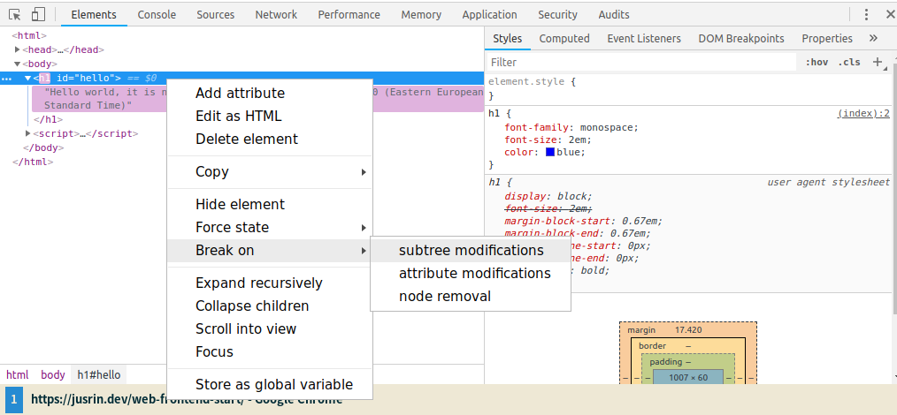
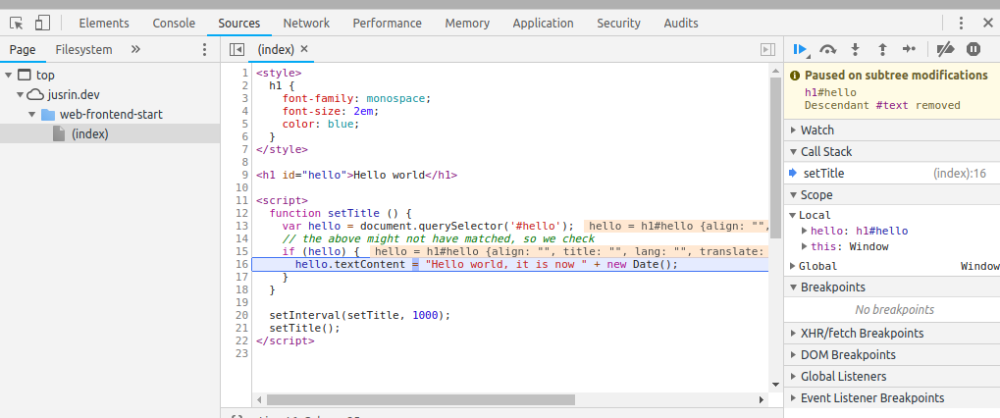
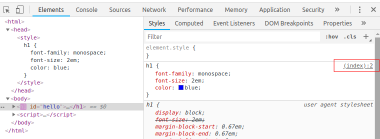

# Web FrontEnd Start

The small parts everyone can learn.

<http://justinwoo.github.io/web-frontend-start/>

## Breakpoints on DOM modifications

First, set the breakpoint

Then see it when the breakpoint is triggered

## Where does this styling come from?

Right click on some element on the page and click "Inspect Element"

The bottom right has a source position which you can click to find out where some style comes from. This may be mangled based on what tools you use.
